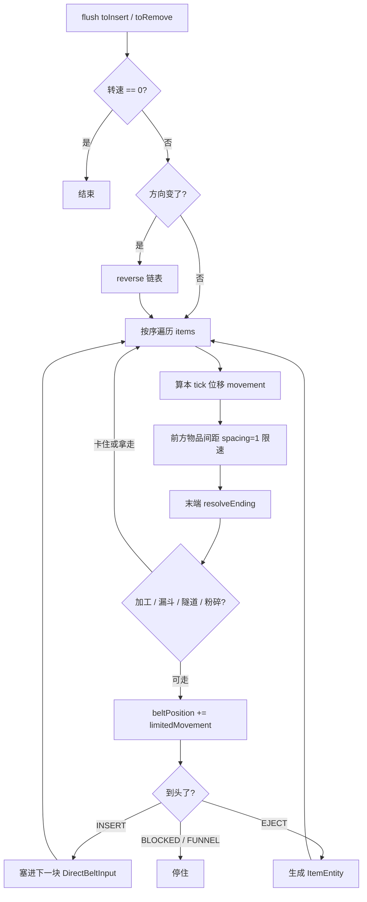

# Create 传送带（Mechanical Belt）调研

> 参考来源：[Creators-of-Create/Create](https://github.com/Creators-of-Create/Create)（开源，分支示例 `mc1.21.1/dev`）  
> 核心路径：`src/main/java/com/simibubi/create/content/kinetics/belt/`  
> 调研目的：为本附属模组设计传送带 / 连续物流时提供实现对照，**非**照搬 Create 玩法与 API。

**一句话结论：不是格子库存，而是「整条皮带一条有序链表 + 连续浮点位置」的仿真。**

---

## 1. 架构分层

| 层 | 类 | 职责 |
| --- | --- | --- |
| 多方块结构 | `BeltBlockEntity` | 一段皮带方块；整条链有一个 **controller**，`beltLength` 记总长 |
| 物品仿真 | `BeltInventory` | **只挂在 controller 上**；每 tick 推进所有物品 |
| 物品状态 | `TransportedItemStack` | 一个正在传送的物品实例 |
| 外部接口 | `ItemHandlerBeltSegment` | 把「某一格」伪装成 `IItemHandler`（1 slot），给漏斗 / 管道用 |
| 交互 | `BeltFunnel*` / `BeltTunnel*` / `BeltCrusher*` 等 | 漏斗、隧道、粉碎轮等旁路逻辑 |
| 坐标工具 | `BeltHelper` | `offset` ↔ 世界坐标 / 中心向量；controller ↔ segment 查找 |

主要源码：

- [BeltInventory.java](https://github.com/Creators-of-Create/Create/blob/mc1.21.1/dev/src/main/java/com/simibubi/create/content/kinetics/belt/transport/BeltInventory.java)
- [TransportedItemStack.java](https://github.com/Creators-of-Create/Create/blob/mc1.21.1/dev/src/main/java/com/simibubi/create/content/kinetics/belt/transport/TransportedItemStack.java)
- [ItemHandlerBeltSegment.java](https://github.com/Creators-of-Create/Create/blob/mc1.21.1/dev/src/main/java/com/simibubi/create/content/kinetics/belt/transport/ItemHandlerBeltSegment.java)
- [BeltHelper.java](https://github.com/Creators-of-Create/Create/blob/mc1.21.1/dev/src/main/java/com/simibubi/create/content/kinetics/belt/BeltHelper.java)

玩法向说明见 Create Wiki：[Mechanical Belt](https://github.com/Creators-of-Create/Create/wiki/Mechanical-Belt)。

---

## 2. 核心数据结构

### 2.1 `TransportedItemStack`（单件物品）

| 字段 | 含义 |
| --- | --- |
| `ItemStack stack` | 实际物品 |
| `float beltPosition` | 沿皮带的连续坐标（单位 ≈ 方块） |
| `float sideOffset` | 横向偏置（视觉 / 并排） |
| `float prevBeltPosition` / `prevSideOffset` | 客户端插值用 |
| `int angle` | 朝向（随机或直立） |
| `int insertedAt` | 从哪一格（segment）插入 |
| `Direction insertedFrom` | 插入方向 |
| `boolean locked` | 被加工机「抓住」 |
| `boolean lockedExternally` | 外部锁定一 tick |
| `FanProcessingType processedBy` / `processingTime` | 风扇批量加工状态 |

实现 `Comparable`，按 `beltPosition` 排序，保证链表顺序 = 沿传送方向的先后。

### 2.2 `BeltInventory`（整条皮带）

```text
LinkedList<TransportedItemStack> items   // 有序主表
LinkedList toInsert / toRemove           // 本 tick 延迟增删，避免边遍历边改
boolean beltMovementPositive             // 方向；反转时 Collections.reverse(items)
TransportedItemStack lazyClientItem      // 客户端平滑过渡残留
```

要点：

- **`LinkedList`**：中间按位置插入、顺序扫描、方向反转都合适。
- **位置是 `float`，不是槽位索引**：物品可停在 `3.47` 这类半格位置。
- **延迟队列**：加工 / 漏斗改集合时不破坏当前 iterator。
- **NBT**：整表序列化为 `Items` 列表 + `PositiveOrder`，不是格子数组。

### 2.3 多方块与坐标

`BeltHelper.getPositionForOffset(controller, offset)`：用 controller 朝向 + 坡度，把整数 `offset`（0…length−1）映射成世界坐标。

整条皮带的物品只存在 **controller 的 `BeltInventory`** 里；各段方块负责外观，以及通过 `ItemHandlerBeltSegment(inventory, offset)` 暴露「该格窗口」给外部插入 / 抽出。

---

## 3. 每 tick 逻辑（`BeltInventory.tick`）



关键细节：

1. **间距防叠**：前方物品距离 ≤ `spacing`（常量 `1`）时限速，形成排队。
2. **末端策略 `Ending`**：`INSERT`（下一块能接）、`EJECT`（吐到世界）、`BLOCKED`（实心挡）、`FUNNEL`。
3. **加工锁定**：水平皮带路过 `BeltProcessingBehaviour` 可 `HOLD` → `locked = true`，停在段中心直到加工完。
4. **横向归中**：`sideOffset` 每 tick 向 `getTargetSideOffset()` 靠拢。
5. **插入**：`addItem` 进 `toInsert`；真正 `insert` 时按 `beltPosition` 二分式扫描插入链表，保持有序。

玩家看到的「物品在皮带上滑」是客户端用 `prevBeltPosition → beltPosition` 插值画出来的；上皮带后通常不再是世界里的 `ItemEntity`（到头 `EJECT` 才会再生成实体）。

---

## 4. 与「槽位式传送带」对照

| 常见做法 | Create |
| --- | --- |
| `ItemStack[N]` 每格一槽 | 连续 `beltPosition` + 有序 `LinkedList` |
| 槽 → 槽 拷贝 / 移位 | 每 tick 加浮点速度 |
| 容量 = 皮带长度 | 容量受间距约束（理论约 length 个） |
| 实体物品一路飞 | 上皮带后进 inventory，实体消失 |

---

## 5. 对本附属模组的可抄 / 可不抄

**可抄的骨架：**

1. **controller + segments**（多方块一根皮带，库存只在 controller）
2. **`LinkedList` + `float position`**（需要连续滑动与半格停靠时）
3. **tick：速度 → 限速排队 → 交互 → 末端插入 / 弹出**
4. **对外：按 segment 包一层「单槽」库存接口**（对接机械臂 / 漏斗式设备）

**不必照搬：**

- Create 风扇批量加工、隧道分流、客户端 `lazyClientItem` 等生态专用逻辑
- Minecraft / NeoForge 的 `IItemHandler`、Capability 细节（SC2 / SCIENEW 用 `IInventory` 等自有契约）
- Create 的动能网（RPM / SU）—— 本模组应接 IE2 已有动力 / 电力模型

**与 IE2 主仓现状的关系：**

主仓已有 Factorio 风格传送带行为（`SubsystemFactorioTransportBeltBlockBehavior` 等，见主仓 `docs/guides/SCIENEW-接口与联网API指南.md` §4.7）。本调研描述的是 **Create 连续位置模型**，与槽位 / 弹射物驱动模型是另一条设计轴；选型时明确要对齐哪一种，避免混用两套语义。

---

*调研记录：2026-07-24*
