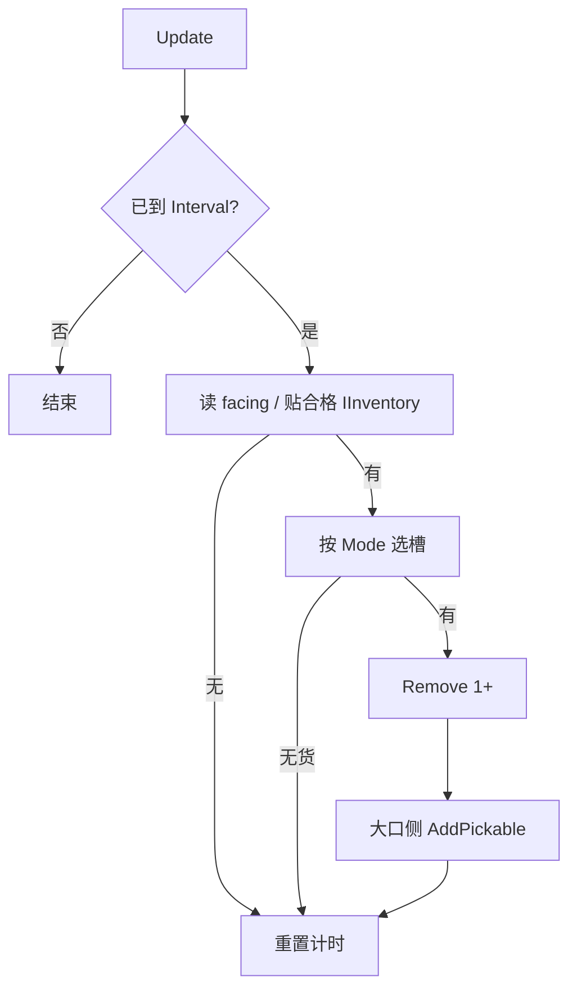
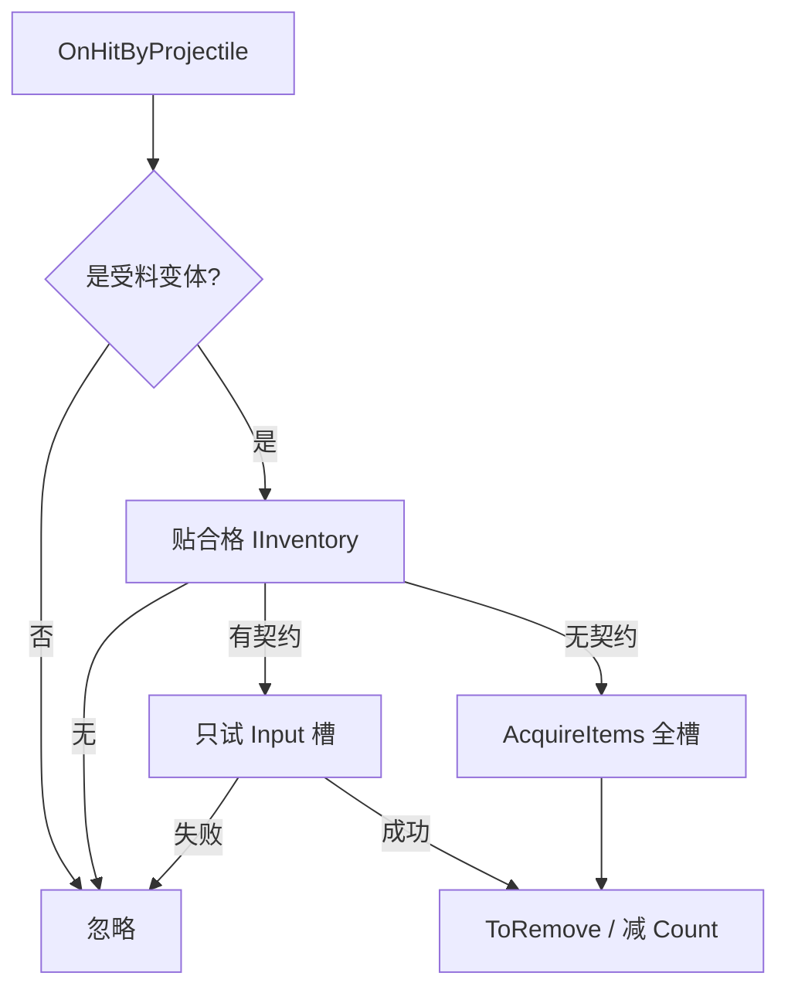

# 料斗（落料斗 / 受料斗）实现计划

> 状态：**已落地（2026-07-26）** — H0–H4、配方、图鉴对齐、朝上弹射均已合入；本文归档，非施工中计划。  
> 范围：`Addons/Logistics` — 在已有 `LogisticsHopperBlock`（Index 554）外观 / 六向 / `IPreferPlacement` 之上接入玩法  
> 决策冻结：单面贴合；窄口=库存侧，大口=掉落物侧；落料默认间隔 **0.25s**、可无极调；受料仅 Input（有契约时）无 fallback  
> 约束：**不改 SCIENEW**（产线契约只调用已有 API；严 Input 在 Logistics 侧自写扫描）  
> **权威性**：玩法 / 落点 / 里程碑以本文为准（历史决策保留）。  
> **后续变更（2026-07-26）**：§1 第 9 条「直连带首发不做」已解除；料斗与输送带的直连收发、落点语义与斗口嵌带外观见 [`输送带实现计划.md`](输送带实现计划.md) §3.1，受料因此也用上同一间隔滑条（§1.3 的「受料无间隔」不再成立）。

---

## 0. 一句话

**落料斗**定时从朝向邻格库存抽出物品，从大口侧弹出为掉落物（默认优先出料区；间隔与模式可在透视对话框里调）。  
**受料斗**接住掉落物，只塞进朝向邻格的 **Input**（无契约则整库接收；塞不下不吃）。

---

## 1. 已冻结决策

| # | 项 | 结论 |
| --- | --- | --- |
| 1 | 空间 | `facing` = 窄口朝向（贴合库存/机器）；大口朝外法向 = 掉落物进出侧 |
| 2 | 放置 | `CellFace.Face`（已落地）；不改视角放置 |
| 3 | 落料节拍 | 默认间隔 **0.25s**；对话框 **Slider 无极调**间隔 |
| 4 | 落料模式 | UI 三档：**出料优先** / **仅出料** / **整库**（默认出料优先） |
| 5 | 落料产出 | 每次抽出成功 → **1 次**变成 Pickable（件数按该次 Remove 结果）；不直写带库存 |
| 6 | 受料插入 | 有 `IInventoryProductionSlots` → **只扫 Input**，失败不 fallback；无契约 → `AcquireItems` 整库 |
| 7 | 受料时机 | `OnHitByProjectile` 为主；可选轻量邻域扫（非首发必须） |
| 8 | 对话框风格 | 仿 `ConveyerBeltDirectionDialog`：下栏控件 + 上透渐变底，可透视方块 |
| 9 | 电 / 过滤 / 直连带 | **首发不做** |
| 10 | SCIENEW | **禁止**改 `ProductionSlotAccess` / `EntityDeviceBehavior`；严 Input 逻辑留在 Logistics |

### 1.1 落料间隔 Slider 范围（建议）

| 项 | 值 |
| --- | --- |
| 默认 | `0.25` 秒 |
| 最小 | `0.05` 秒 |
| 最大 | `2.0` 秒 |
| 粒度 | 连续（`Granularity` 小步如 `0.05`，或宿主 Slider 允许的最小步） |
| 存档 | `float IntervalSeconds`；非法值钳到范围 |

状态行显示当前间隔（如 `0.25 s`）与模式名。

### 1.2 落料抽槽模式

| 枚举 | 玩家文案（建议） | 行为 |
| --- | --- | --- |
| `OutputPreferred` | 出料优先 | 调 `ProductionSlotAccess.GetInventorySourceSlotOrder`（优先 Output，无候选 fallback 全槽） |
| `OutputOnly` | 仅出料 | 只迭代 `ProductionSlotKind.Output`；无声明或空则本 tick 不抽 |
| `EntireInventory` | 整库 | `0 .. SlotsCount-1` 顺序扫非空槽 |

循环切换按钮即可（仿输送带「切换方向」），不必下拉框。

### 1.3 受料对话框

受料无间隔；对话框仍打开（空手点），内容：

- 标题「受料斗」
- 状态：贴合目标有无库存 / 是否声明 Input / 最近拒收原因（可选简文）
- 关闭按钮  
首发**可不调模式**（插入规则写死 §1 表）。若实现成本低，可预留「仅机器 / 含箱子」开关，**非门禁**。

---

## 2. 架构与落点

```text
LogisticsHopperBlock          // 已有：变体 + 六向 + 放置
SubsystemLogisticsHopperBlockBehavior
  OnBlockAdded/Removed/Generated → Entity
  OnInteract → HopperDialog（透视）
  OnHitByProjectile → 仅受料变体转发 Component
ComponentLogisticsHopper      // 或 Input/Output 两个 Component；推荐一组件 + Variant 分支
  Update：落料计时抽取弹出
  TryAbsorb：受料塞入
HopperDialog                  // 代码拼控件，仿 ConveyerBeltDirectionDialog
```

| 路径 | 职责 |
| --- | --- |
| `Blocks/LogisticsHopperBlock.cs` | 已有；补 `IsInteractive => true` |
| `Components/ComponentLogisticsHopper.cs` | 状态、Update、吸/吐逻辑、Load/Save |
| `Subsystems/SubsystemLogisticsHopperBlockBehavior.cs` | 实体生命周期、交互、掉落命中 |
| `Dialogs/HopperDialog.cs` | 间隔 Slider + 模式切换 + 状态 + 关闭 |
| `Logistics.xdb` | EntityTemplate + Project 注册 Behavior |
| `Logistics.csv` | Behaviors 挂上 `LogisticsHopperBlockBehavior`；`DefaultIsInteractive=TRUE` |
| `Assets/Lang/*` | 对话框键、模式名、状态句 |

**禁止**新建 SCIENEW 接口或改宿主抓取路径。

---

## 3. 组件字段（建议）

```text
ComponentLogisticsHopper
  LogisticsHopperVariant Variant   // 或从格 Data 每帧读，避免改朝向不同步
  float IntervalSeconds            // 默认 0.25；仅落料用
  ExtractMode Mode                 // 仅落料用
  double m_nextFireTime            // 落料下次可抽时刻
```

- 朝向 / 变体：**以地形 Data 为准**（电钻调向后无需迁组件字段）。
- 贴合点：`cell - FaceToPoint3(facing)`。
- 大口弹出点：`cell 中心 + 0.6 * FaceToVector3(OppositeFace(facing))`（调手感）。

存档键：`IntervalSeconds`、`ExtractMode`（int）；缺省兼容旧档。

---

## 4. 运行时流程

### 4.1 落料



- 计时用 `SubsystemTime.GameTime`；成功或空转都推进 `m_nextFireTime += Interval`（或空转也推进，避免狂扫）。
- **推荐**：无论有无货，到点都推进间隔（恒定节拍）；有货才弹出。

### 4.2 受料



严 Input 伪代码（Logistics 内，**不要**调 `TryInsertIntoInputSlots`）：

```csharp
// 有 IInventoryProductionSlots：foreach Input index → TryInsert 单槽
// 全部失败 → return false（不吃）
```

### 4.3 交互

- 空手（或非 `IPreferPlacement`）：开 `HopperDialog`。
- 手持 `IPreferPlacement`：Behavior 已 `return false` 走放置（已有）。

---

## 5. 对话框 UI（仿输送带）

复用模式：

- `Dialog` + 底部 `StackPanel`（标题 / 状态 / 控件 / 关闭）
- `GradientBackdropWidget` 可抽成共享，或先复制一份到 `HopperDialog`（忌过早抽象；两处都稳后再抽）
- `CoverWidget.FillColor = Transparent`
- 尺寸边距 **4 的倍数**

落料控件行：

1. **模式按钮**：点击循环 `OutputPreferred → OutputOnly → EntireInventory`
2. **间隔 Slider**：`Min=0.05 Max=2.0`，旁白或状态行显示 `{0:0.00} s`
3. **关闭**

受料：标题 + 状态 + 关闭（无 Slider / 模式，除非做可选开关）。

Lang 键挂 `ContentWidgets.HopperDialog`（或分 `DischargeHopperDialog` / `IntakeHopperDialog` 共一文件两标题）。

玩家文案禁止路径/类名；模式用「出料优先 / 仅出料 / 整库」。

---

## 6. 分阶段实现

### H0 — 实体与交互壳

1. `Logistics.xdb`：`LogisticsHopper` EntityTemplate + `ComponentLogisticsHopper`；Project 注册 Behavior  
2. CSV：`LogisticsHopperBlockBehavior`；交互 TRUE  
3. Behavior：Added/Removed/Generated 建删实体；`OnInteract` 开空壳对话框（可先无 Slider）  
4. Block：`IsInteractive => true`

**验收**：两种料斗可点开透视对话框并关闭；调向后对话框仍对应当前格。

### H1 — 落料吐物

1. Update：0.25s 节拍；贴合 `IInventory`；`OutputPreferred` 抽一件弹出  
2. 弹出位置 / 初速手感可接受；皮带能吸走  
3. 存档读写 `IntervalSeconds` / `Mode`（此时 Mode 可仍默认）

**验收**：贴铁箱/储存库/机器出料侧，地上或带上稳定出货；拆掉实体不丢设置（重进世界保留）。

### H2 — 落料 UI：间隔 + 模式

1. Slider 无极调间隔并立即生效  
2. 模式按钮三档；`OutputOnly` / `EntireInventory` 行为正确（有/无契约机器各测一台）  
3. 状态行刷新间隔与模式名  

**验收**：拖到最快/最慢可感；「仅出料」不抽燃料 Consume 格。

### H3 — 受料严进料

1. `OnHitByProjectile` → 严 Input 或整库  
2. Input 满则不吃；机器自吃路径不依赖本斗  
3. 受料对话框状态（有无目标即可）  

**验收**：落料 → 掉落 → 受料 → 只进下一台 Input；满料时掉落物残留；贴储存库可进库。

### H4 — 收口

1. Lang 中英完整；创造栏描述与实现一致  
2. 与 `IPreferPlacement` 回归：手持料斗贴储存库仍放置  
3. 黑盒表勾完；本计划标 **已落地**

---

## 7. 验收总表

| 里程碑 | 通过条件 |
| --- | --- |
| M-H0 | 实体 + 透视对话框可开可关 |
| M-H1 | 落料默认 0.25s 吐掉落物，带可吸 |
| M-H2 | Slider 无极间隔 + 三模式正确 |
| M-H3 | 受料仅 Input（有契约）/ 箱可进；满则拒 |
| M-H4 | 文案、放置优先、存档往返 OK |

---

## 8. 非目标（本施工单）

- 改 SCIENEW / 宿主 `EntityDeviceBehavior`（IE2 箱开界面手持料斗仍可能开 UI）  
- 过滤名单、电路门控、机械能门控  
- 直写 `BeltSegment` 库存  
- 废料斗 / 排污口 / 斗式提升机  
- ~~配方（锌叙事按 `原料与锌消耗.md`）~~ ✅ `Logistics.ier`：落料/受料上下镜像

---

## 9. 风险

| 风险 | 缓解 |
| --- | --- |
| `TryInsertIntoInputSlots` 带 fallback | 受料**禁止**调用；自写 Input 循环 |
| 弹出瞬间被同格斗/带吸回 | 对齐带的 Pickable 等待期；弹出点偏大口外 |
| 极短间隔刷屏 | Slider 下限 0.05；每 tick 最多一次尝试 |
| 对话框遮挡调参 | 必须透视底（同输送带） |
| 电钻调向后贴合错边 | 逻辑每帧读地形 Data，不缓存 facing |

---

## 10. 收尾记录

已合入：H0–H4 玩法、锌板+抓取机上下镜像配方、创造栏 Data 与 `.ier` 对齐（图鉴可见配方）、落料朝上时加大竖直上抛初速。

*计划订立：2026-07-26 — 对齐用户冻结：0.25s 默认、Slider 无极、模式 UI、其余语义按料斗设计讨论。*  
*收尾归档：2026-07-26。*
