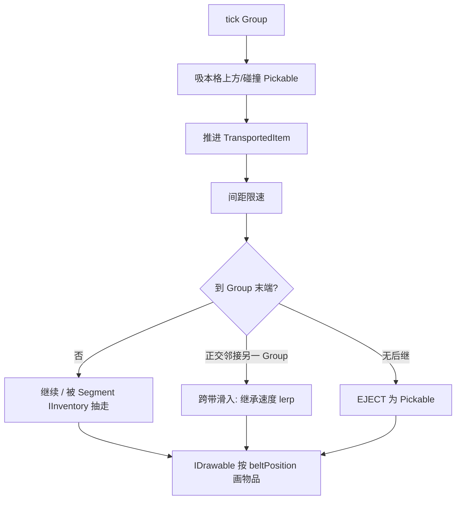

# 输送带（Create 连续物流）实现计划

> 状态：**施工中**（P0 Group 骨架已过黑盒；下一步 P1 连续运物）  
> 范围：`Addons/Logistics` — 在现有外观 / 自动布设之上接入真实运物  
> 对照：Create Mechanical Belt、仓内 [Create传送带调研.md](archive/Create传送带调研.md)、SA 源码全文摘录 [SA-ComponentSAConveyerBelt-源码摘录.md](archive/SA-ComponentSAConveyerBelt-源码摘录.md)、物流 `AdvancedInserter` 的 `IInventory`  
> 决策冻结：速度 **定速 + 符号方向**；玩家 **不被动截胡**  
> 兼容：未发版 — **无需**旧档向下兼容；主仓 Factorio 带仅供参考、不打包，**不**作为并存约束  
> **权威性**：**玩法 / 源码 / 逻辑一律以本文为准。** SA 摘录与外部 SA 仓库**仅供参考**，**禁止**一比一复刻其玩法、源码或逻辑；可抄的是算法碎片（如轨迹、推 Velocity），落地形态须符合下文 Group / Controller / 冻结决策。

---

## 0. 一句话架构

对齐 Create：**一条直线（含坡）= 一个 Group**；物品仿真与库存只在 **Controller**；每格用 **IInventory 门面**给抓取机抽/塞「正在经过」的物品；位置是连续 `beltPosition`，不是每格真多槽。直角靠 **两个 Group 端点正交滑入** 并做速度继承。实体推动（可参考 SA 的 Velocity 推法，**非**照搬其整套组件/库存模型）与物品仿真解耦。

材质滚动与仿真速度**解耦**：首发视觉定速；物品位移用 `Sign × |Speed|`。

---

## 1. 已冻结决策（A / B）

### 1.1 A — 速度是否 `[-Speed, Speed]` 无极调

| 维度 | 结论 |
| --- | --- |
| Create | RPM 连续；反向 = 动能反向；材质随转速滚 |
| 实现 | 当前 `ConveyerBeltAnimatedTexture` 为**全局单 RT**，所有带子共享滚动相位；地形 mesh UV 已烘焙，无法按 Group 逐帧改 scroll |
| 玩法 | 无极调有价值，但视觉与仿真脱节会损可信度 |

**采纳（首发）**

- 仿真：`float` 位移，幅度为常数 `|Speed|`，方向为 `Group.Sign ∈ {+1, -1}`（往 / 来）
- 视觉：继续全局滚动 RT；方向靠推进符号（必要时对反向 Group 做 UV 翻转 / 数据位）
- 字段可预留 `float speed` 便于以后接动力，但 **v1 不承诺视觉无极调**
- 以后可选：离散档（停 / 慢 / 快）、每 Group 独立 RT、或着色器时间 UV

**不采纳（首发）**：真·无极幅度 + 每带独立材质滚动。

### 1.2 B — 玩家碰触是否截胡成掉落物

| 维度 | 结论 |
| --- | --- |
| Create | 上皮带后不是世界掉落物；**不会**被动进玩家背包；漏斗 / 臂显式取走 |
| 实现 | 碰触 → Pickable 与「IInventory 在途物」双轨冲突，和臂抢货、竞态多 |
| 玩法 | 路过拆线，自动化不稳 |

**采纳**

- 在途物只做绘制，**不**因玩家碰撞变成 Pickable / 进背包
- 落地途径：末端弹出、抓取机等经 IInventory 抽出
- 可选后续（非首发）：潜行 + 右键「取一件」——显式交互，非碰撞

**不采纳**：碰撞被动截胡。

---

## 2. 信源摘要

| 来源 | 角色 | 用途 |
| --- | --- | --- |
| **本文（实现计划）** | **权威** | 玩法、架构、冻结决策、里程碑；冲突时以本文为准 |
| [Create Wiki · Mechanical Belt](https://github.com/Creators-of-Create/Create/wiki/Mechanical-Belt) | 语义对照 | 在途物非被动拾取；实体可被带；潜行可下带 |
| [Create传送带调研.md](archive/Create传送带调研.md) | 语义蒸馏 | Controller + `LinkedList` + `float beltPosition`；tick：推进 / 限速 / 末端；Segment 单槽门面 |
| [SA-ComponentSAConveyerBelt-源码摘录.md](archive/SA-ComponentSAConveyerBelt-源码摘录.md) | **仅供参考** | 嵌入全文便于查算法；**不可**一比一复刻玩法 / 源码 / 逻辑（单格槽 + Progress ≠ 本计划目标） |
| `ComponentAdvancedInserter` | 本仓接口 | `FindComponent<IInventory>()` 抽塞邻格 |
| 当前 Logistics `ConveyerBeltBlock` / Behavior / `ConveyerBeltAnimatedTexture` | 已有基线 | 几何 Data、自动朝向 / 爬坡（不转弯）、全局滚动贴图 |

主仓 `SubsystemFactorioTransportBeltBlockBehavior`：**废弃、不打包**，算法可作对照，**不**作为产品并存或门禁。

---

## 3. 目标语义对照

| 能力 | Create | 本模组目标 | 备注 |
| --- | --- | --- | --- |
| 库存模型 | Controller 链表 + float 位 | 同左 | 非每格真实多槽数组 |
| 对外接口 | Segment `IItemHandler` | Segment `IInventory` 门面 | 对接高级抓取机 |
| 输入 | 漏斗 / 掉落吸附 | 设备塞入 + 吸 Pickable | Behavior / `OnHitByProjectile` |
| 输出 | 末端弹出 / 漏斗抽 | 末端 Pickable + 臂抽 | 「半路截胡」= 物流设施 |
| 直角 | 同带可弯等 | 两 Group 正交端点滑入 | 保留速度再对齐目标带 |
| Grouping | 多方块一根皮带 | 同线含坡连通分量 | 与现有「不转弯」布设一致 |
| 控制器 | 动能 / 轴 | Group 上 Sign（及后续 UI） | 调方向 |
| 实体 | 站上被带；潜行可下 | 同 SA 推 Velocity（见[摘录](archive/SA-ComponentSAConveyerBelt-源码摘录.md) §6） | 与物品仿真分离 |
| 反向 | 轴转向 | `Group.Sign` | v1 字段；UI 可后补 |
| 玩家捡在途物 | 否（非被动） | 否 | 见 §1.2 |

---

## 4. 核心数据设计

### 4.1 Group / Controller

```text
BeltGroup
  Guid Id
  Point3 Controller          // 约定：某一端或稳定选举规则
  List<Point3> Members       // 沿带顺序（含坡）
  int Sign                   // +1 / -1
  float SpeedAbs             // v1 = 常数；预留
  BeltInventory Inventory    // 只挂在 controller 侧逻辑
```

- **Grouping**：四向 + 上下坡邻接的同 Index 连通分量，且几何上为**单线**（现有 Behavior 已避免转弯）
- **Controller**：Group 重建时选举（例如世界坐标字典序最小，或「下游端」）；变更时迁移 Inventory
- **存档**：`SubsystemBeltGroups` Load/Save（世界级，注册 `Logistics.xdb`）

### 4.2 在途物品

```text
TransportedItem
  int Value, Count
  float BeltPosition         // 沿 Group 弧长，单位 ≈ 方块
  float SideOffset           // 横向偏置，tick 归中
  Vector3 Velocity           // 世界切向；跨 Group 交接时继承再 lerp
  // 可选：InsertedAt、Locked（加工类，首发可不做）
```

- 容器：有序表（`LinkedList` 或按 `BeltPosition` 排序的列表）
- 间距限速：前方物品距离 ≤ spacing（建议 ≈ 1）时限速，形成排队
- **不是**世界 `Pickable`，直到末端 EJECT 或被抽出后由臂丢出

### 4.3 Segment `IInventory` 门面

- 每格对外暴露 **1 逻辑槽**（或「窗口」）：表示「当前经过该格中心附近」的物品
- `AcquireItems` / `RemoveSlotItems` / `GetSlotValue`：映射到 Group.Inventory 的插入 / 按位置抽取
- 实现位置二选一（实现时定一）：
  - **推荐**：轻量 BlockEntity + `ComponentConveyerBeltSegment` 实现 `IInventory`（抓取机已找 Entity 上组件）
  - 或纯子系统查询（需改抓取机，**不推荐**）

未发版：可直接加实体，**不做**无实体兼容层。

### 4.4 方块 Data（现状保留）

| 位 | 含义 |
| --- | --- |
| bit0–1 | `rotation`（0..3） |
| bit2 | `shape`（0 平直 / 1 坡道） |

方向 Sign **不**进方块 Data（在 Group / Controller）；与先前「来往进组件」方向一致，现升到 Group。

---

## 5. 运行时流程



**物品动画**：服务端（或本机）推进位置；绘制用当前位置（可加上一帧插值若需要更顺）。

**实体推动**：独立于上图；站立带面且 Sign≠0（或「运转中」）时 `Velocity += trackDirection * k * dt`；潜行不推（对齐 Create / SA）。

---

## 6. 分阶段实现（开发步骤）

### P0 — Group 骨架

1. ~~新增 `SubsystemBeltGroups`，`Logistics.xdb` 注册~~  
2. ~~邻接变更 / 放置 / 拆除时 Rebuild（沿朝向轴双向连通；直角不同组）~~  
3. ~~选举 Controller、维护有序 `Members`、存档 Guid 与成员~~  
4. ~~Behavior 保留自动朝向 / 爬坡，变更时 `RequestRebuild`~~  
5. ~~`Group.Sign` 默认 +1；F6 调试绘制 + 点击提示本格序号~~

**验收**：连成一线（含坡）为同一 Group；直角为两组；打断后拆成两个；重进世界成员与 Controller 稳定。**已过黑盒（2026-07-25）。**

### P1 — 连续物流仿真

1. `BeltInventory` + `TransportedItem`；只挂 Controller 逻辑  
2. tick：`BeltPosition += Sign * SpeedAbs * dt`；间距限速  
3. 输入：Behavior 吸掉落物 → 插入对应位置  
4. 输出：末端无后继 → `SubsystemPickables.AddPickable`  
5. `IDrawable`（子系统或 Controller 组件）按位置画方块图标 / mesh  

**验收**：丢物品上皮带能滑到尽头弹出；多件排队不重叠；滚动贴图与物品同向观感可接受（定速）。

### P2 — IInventory 对接抓取机

1. 每格实体 + `ComponentConveyerBeltSegment : IInventory`（门面）  
2. 插入：映射到 Group，落到该格中心附近 `BeltPosition`  
3. 抽出：取该格窗口内优先物品，从链表移除  
4. 实机：高级抓取机对传送带抽 / 塞  

**验收**：臂能从中段抽走在途物；能往空段塞入；与末端弹出不冲突。

### P3 — 直角速度继承

1. 检测 Group 末端正交邻接另一 Group 入口  
2. 交接：保留世界速度，向目标切向 `lerp`（仿机械动力手感）  
3. `SideOffset` 归中  

**验收**：直角两带交汇时物品不瞬移、不硬拐一帧；速度在数 tick 内对齐。

### P4 — 实体推动

1. 参考 SA：站立值 = 输送带、非潜行 → 加速度  
2. 与物品仿真分离；坡道方向用现有 `rotation` / `shape` 算轨迹  

**验收**：玩家 / 生物站上被带走；潜行可停。

### P5 — 打磨（可选，非首发 blocker）

1. Controller / 任意段交互：切换 `Sign`（恢复轻量 UI 亦可）  
2. 离散速度档 + 材质档（若仍用单 RT，则仅改全局或接受「档位=全局」）  
3. 最大 Group 长度、性能剖析  
4. 图鉴 / Lang 更新（玩家文案，禁止路径 / 类名泄露）

---

## 7. 建议文件落点（实现时按此拆，可微调）

| 路径 | 职责 | 现况 |
| --- | --- | --- |
| `Subsystems/SubsystemBeltGroups.cs` | Group 发现 / 存档 / 脏重建；F6 调试绘制 | ✅ P0 |
| `Belt/BeltGroup.cs` | Group 状态 | ✅ P0 |
| `Belt/BeltInventory.cs` | 链表与推进 | 待建 |
| `Belt/TransportedItem.cs` | 在途物 | 待建 |
| `Belt/BeltSegmentInventory.cs` | IInventory 门面 | 待建 |
| `Components/ComponentConveyerBeltSegment.cs` | 实体上挂门面 | 待建 |
| `Blocks/ConveyerBeltBlock.cs` | 几何 / 渲染 | ✅ 已有 |
| `Subsystems/SubsystemConveyerBeltBlockBehavior.cs` | 放置、邻接自动朝向/爬坡；接 Group 重建 | ✅ P0 |
| `Subsystems/SubsystemConveyerBeltVisuals.cs` | 滚动贴图驱动 | ✅ 已有 |
| `Drawing/ConveyerBeltAnimatedTexture.cs` | 滚动 RT | ✅ 已有；变速视觉后置 |
| `Logistics.xdb` | Subsystem + EntityTemplate | ✅ BeltGroups；Segment 待补 |
| `docs/archive/Create传送带调研.md` | 调研归档 | ✅ |
| `docs/输送带实现计划.md` | 本文 | 施工单 |

---

## 8. 风险

| 风险 | 缓解 |
| --- | --- |
| 长 Group 单点 tick 成本 | 限制最大长度或分帧；先测再优化 |
| 区块未加载成员 | 只仿真已加载段；边界物品缓出或暂停出界 |
| 全局 RT 与反向观感 | Sign 推进 + 必要时 UV 翻转；不承诺每带不同滚速 |
| Controller 迁移丢物 | Rebuild 时整表迁移 Inventory，禁止「先清空再重建」无备份路径 |
| 抓取机窗口语义模糊 | 文档化「格心 ±0.5」窗口；单测 / 手测表 |

**明确不作为风险**：主仓 Factorio 带并存；旧世界无实体兼容。

---

## 9. 非目标（首发）

- Create 隧道 / 风扇批量加工 / Content Observer  
- 同带 90° 转弯几何（继续「不转弯」布设）  
- 视觉无极变速、每 Group 独立滚动材质  
- 玩家碰撞被动截胡  
- 与主仓 Factorio 传送带互通或替换  
- 发版前旧档迁移  

---

## 10. 验收总表（里程碑）

| 里程碑 | 通过条件 |
| --- | --- |
| M0 | Group 连 / 断 / 直角分 / 存档正确 | ✅ |
| M1 | 掉落物 → 滑动 → 末端弹出；物品有动画 |
| M2 | 高级抓取机可抽可塞中段 |
| M3 | 直角两带速度继承手感可接受 |
| M4 | 站立实体被推动；潜行可停 |
| 打磨 | Sign 可调；文案与图鉴；无调试残留 |

---

## 11. 下一步

从 **P1 连续物流仿真** 开工：`BeltInventory` / `TransportedItem`、吸掉落、末端弹出、按位置绘制在途物。

*计划修订：2026-07-25 — 冻结 A/B；剔除 Factorio 并存与无实体兼容。P0 黑盒通过（沿轴双向编组 + F6 调试）。*
