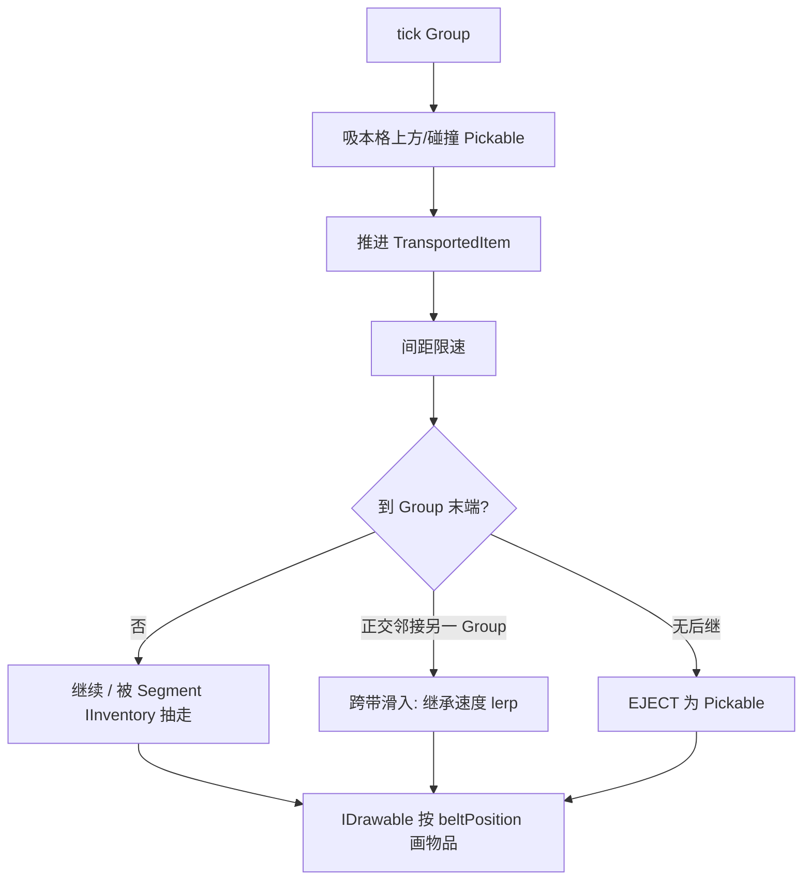

# 输送带（Create 连续物流）实现计划

> 状态：**已落地（2026-07-26）** — P0–P7 / M0–M7 均已过黑盒；本文保留为设计与验收记录，非施工中计划。  
> 范围：`Addons/Logistics` — 在现有外观 / 自动布设之上接入真实运物  
> 对照：Create Mechanical Belt、仓内 [Create传送带调研.md](archive/Create传送带调研.md)、SA 源码全文摘录 [SA-ComponentSAConveyerBelt-源码摘录.md](archive/SA-ComponentSAConveyerBelt-源码摘录.md)、物流 `AdvancedInserter` 的 `IInventory`  
> 决策冻结：速度 **定速 + 符号方向**；玩家 **不被动截胡**  
> 兼容：未发版 — **无需**旧档向下兼容；主仓 Factorio 带仅供参考、不打包，**不**作为并存约束  
> **权威性**：**玩法 / 源码 / 逻辑一律以本文为准。** SA 摘录与外部 SA 仓库**仅供参考**，**禁止**一比一复刻其玩法、源码或逻辑；可抄的是算法碎片（如轨迹、推 Velocity），落地形态须符合下文 Group / Controller / 冻结决策。

---

## 0. 一句话架构

对齐 Create：**一条直线（含坡）= 一个 Group**；物品仿真与库存只在 **Controller**；每格用 **IInventory 门面**给抓取机抽/塞「正在经过」的物品；位置是连续 `beltPosition`，不是每格真多槽。直角靠 **两个 Group 端点正交滑入** 并做速度继承。实体推动（可参考 SA 的 Velocity 推法，**非**照搬其整套组件/库存模型）与物品仿真解耦。

材质滚动与仿真速度**解耦**：首发视觉定速；物品位移用 `Sign × |Speed|`。

---

## 1. 已冻结决策（A / B）

### 1.1 A — 速度是否 `[-Speed, Speed]` 无极调

| 维度 | 结论 |
| --- | --- |
| Create | RPM 连续；反向 = 动能反向；材质随转速滚 |
| 实现 | 全局单 RT 固定滚向；`reverse`/`powered` 进 Data；mesh UV 翻转与静/动半区（对齐 SA） |
| 视觉 | RT 有运转就滚；反向 = Data.reverse 翻 UV；停转 = powered=0 采静区 |
| 仿真 | `float` 位移，`Sign × \|Speed\|`；Sign 权威在 Group，同步到各格 reverse |
| 铺设 | 视线决定 rotation 轴 + reverse；邻接 `UpdateOrientation` 只改 shape/rotation，**保留** reverse/powered |
| 编组 | 连通只看朝向轴；Sign：旧组保留 / 新组由格 reverse 多数决；每帧 Sync reverse+powered |
| 玩法 | 无极调有价值，但视觉与仿真脱节会损可信度 |

**采纳（首发）**

- 仿真：`float` 位移，幅度为常数 `|Speed|`，方向为 `Group.Sign ∈ {+1, -1}`（往 / 来）
- 视觉：全局 RT 固定滚向 + Data `reverse`/`powered`（见 **P6**）
- 字段可预留 `float speed` 便于以后接动力，但 **不承诺视觉无极调**
- **离散速度档 / 材质档：暂不排期（已从 P7 废除）**
- **机械能停/转**（有动力才推进）：已落地 **P4**

**不采纳（首发）**：真·无极幅度 + 每带独立材质滚动。

> **体验债（2026-07-25）**：主干可运物后，材质滚动与实际推进方向仍常相反/脱节，且无调向 UI。已从「杂糅 P6 可选打磨」拆出 **P6（观感与调向）** 优先；其余工程债进 **P7**。

### 1.2 B — 玩家碰触是否截胡成掉落物

| 维度 | 结论 |
| --- | --- |
| Create | 上皮带后不是世界掉落物；**不会**被动进玩家背包；漏斗 / 臂显式取走 |
| 实现 | 碰触 → Pickable 与「IInventory 在途物」双轨冲突，和臂抢货、竞态多 |
| 玩法 | 路过拆线，自动化不稳 |

**采纳**

- 在途物只做绘制，**不**因玩家碰撞变成 Pickable / 进背包
- 落地途径：末端弹出、抓取机等经 IInventory 抽出
- 可选后续（非首发）：潜行 + 右键「取一件」——显式交互，非碰撞

**不采纳**：碰撞被动截胡。

---

## 2. 信源摘要

| 来源 | 角色 | 用途 |
| --- | --- | --- |
| **本文（实现计划）** | **权威** | 玩法、架构、冻结决策、里程碑；冲突时以本文为准 |
| [Create Wiki · Mechanical Belt](https://github.com/Creators-of-Create/Create/wiki/Mechanical-Belt) | 语义对照 | 在途物非被动拾取；实体可被带；潜行可下带 |
| [Create传送带调研.md](archive/Create传送带调研.md) | 语义蒸馏 | Controller + `LinkedList` + `float beltPosition`；tick：推进 / 限速 / 末端；Segment 单槽门面 |
| [SA-ComponentSAConveyerBelt-源码摘录.md](archive/SA-ComponentSAConveyerBelt-源码摘录.md) | **仅供参考** | 嵌入全文便于查算法；**不可**一比一复刻玩法 / 源码 / 逻辑（单格槽 + Progress ≠ 本计划目标） |
| `ComponentAdvancedInserter` | 本仓接口 | `FindComponent<IInventory>()` 抽塞邻格 |
| 当前 Logistics `ConveyerBeltBlock` / Behavior / `ConveyerBeltAnimatedTexture` | 已有基线 | 几何 Data、自动朝向 / 爬坡（不转弯）、全局滚动贴图 |

主仓 `SubsystemFactorioTransportBeltBlockBehavior`：**废弃、不打包**，算法可作对照，**不**作为产品并存或门禁。

---

## 3. 目标语义对照

| 能力 | Create | 本模组目标 | 备注 |
| --- | --- | --- | --- |
| 库存模型 | Controller 链表 + float 位 | 同左 | 非每格真实多槽数组 |
| 对外接口 | Segment `IItemHandler` | Segment `IInventory` 门面 | 对接高级抓取机 |
| 输入 | 漏斗 / 掉落吸附 | 设备塞入 + 料斗直连 + 吸 Pickable | Behavior / `OnHitByProjectile`；直连见 §3.1 |
| 输出 | 末端弹出 / 漏斗抽 | 末端 Pickable + 臂抽 + 料斗直连 | 「半路截胡」= 物流设施 |
| 直角 | 同带可弯等 | 两 Group 正交端点滑入 | 保留速度再对齐目标带 |
| Grouping | 多方块一根皮带 | 同线含坡连通分量 | 与现有「不转弯」布设一致 |
| 控制器 | 动能 / 轴 | 任一段两侧邻接机械能 → 整组运转；`Sign` 定方向 | 见 **P4** |
| 实体 | 站上被带；潜行可下 | 同 SA 推 Velocity（见[摘录](archive/SA-ComponentSAConveyerBelt-源码摘录.md) §6） | 仅「运转中」推动；见 P5 |
| 反向 | 轴转向 | `Group.Sign` | 动力只决定停/转；反向仍用 Sign（UI 可后补） |
| 玩家捡在途物 | 否（非被动） | 否 | 见 §1.2 |

### 3.1 料斗直连与带内落点（2026-07-26）

对齐 Create 漏斗：贴带的料斗不再经掉落物中转，物品直接上下带。

| 项 | 行为 |
| --- | --- |
| 落料斗大口对带 | 直接放上带；带上没空位就把货留在源容器里排队（背压），**不**在带边堆掉落物 |
| 受料斗大口对带 | 按自身间隔从大口那格取一件塞进窄口容器；塞不下就不取 |
| 落点参数 | `SubsystemBeltGroups.TryInsertItem(cell, value, count, cellFraction)`：`cellFraction` 为格内无极位置，`0` = 该格弧长小端、`0.5` = 格心、`1` = 大端；整组两端留 `BeltSegmentInventory.EndInset` |
| 落点推断 | `TryInsertItemFrom(cell, sourceCenter, ...)`：来料方向与该格带走向的点积绝对值 ≥ `0.7` 视为正对端口 → 落靠来料那一端；否则（侧面 / 上下）落格心 |
| 抓取机 / 分拣机 | 输出到带时走同一门面，正对端口不再固定落格心 |
| 斗口外观 | 大口与带同轴时，在料斗格内按邻格 data 画一段带（强制 `shape=0`，沿用 `reverse` / `powered`）；只跟随外部带的方向与运转，不参与带逻辑与碰撞 |

同轴判定与外观、落点共用一套语义：只有「正对端口」才既延伸外观又塞端口；侧向贴靠仍是横穿式喂料，落格心。

---

## 4. 核心数据设计

### 4.1 Group / Controller

```text
BeltGroup
  Guid Id
  Point3 Controller          // 约定：某一端或稳定选举规则
  List<Point3> Members       // 沿带顺序（含坡）
  int Sign                   // +1 / -1
  float SpeedAbs             // v1 = 常数；预留
  BeltInventory Inventory    // 只挂在 controller 侧逻辑
```

- **Grouping**：四向 + 上下坡邻接的同 Index 连通分量，且几何上为**单线**（现有 Behavior 已避免转弯）
- **Controller**：Group 重建时选举（例如世界坐标字典序最小，或「下游端」）；变更时迁移 Inventory
- **存档**：`SubsystemBeltGroups` Load/Save（世界级，注册 `Logistics.xdb`）

### 4.2 在途物品

```text
TransportedItem
  int Value, Count
  float BeltPosition         // 沿 Group 弧长，单位 ≈ 方块
  float SideOffset           // 横向偏置，tick 归中
  Vector3 Velocity           // 世界切向；跨 Group 交接时继承再 lerp
  // 可选：InsertedAt、Locked（加工类，首发可不做）
```

- 容器：有序表（`LinkedList` 或按 `BeltPosition` 排序的列表）
- 间距限速：前方物品距离 ≤ spacing（建议 ≈ 1）时限速，形成排队
- **不是**世界 `Pickable`，直到末端 EJECT 或被抽出后由臂丢出

### 4.3 Segment `IInventory` 门面

- 每格对外暴露 **1 逻辑槽**（或「窗口」）：表示「当前经过该格中心附近」的物品
- `AcquireItems` / `RemoveSlotItems` / `GetSlotValue`：映射到 Group.Inventory 的插入 / 按位置抽取
- 实现位置二选一（实现时定一）：
  - **推荐**：轻量 BlockEntity + `ComponentConveyerBeltSegment` 实现 `IInventory`（抓取机已找 Entity 上组件）
  - 或纯子系统查询（需改抓取机，**不推荐**）

未发版：可直接加实体，**不做**无实体兼容层。

### 4.4 方块 Data

| 位 | 含义 |
| --- | --- |
| bit0–1 | `rotation`（0..3） |
| bit2 | `shape`（0 平直 / 1 坡道） |
| bit3 | `reverse`（0→Sign+1，1→Sign-1；视觉 UV 翻转） |
| bit4 | `powered`（0 静区左半，1 滚动右半） |

仿真权威仍是 `Group.Sign`；每帧 / 调向时 Sync 到各格 `reverse`。邻接自动朝向**不得**清掉 bit3/4。

---

## 5. 运行时流程



**物品动画**：服务端（或本机）推进位置；绘制用当前位置（可加上一帧插值若需要更顺）。

**实体推动**：独立于上图；站立带面且 **运转中**（P4 机械能）时 `Velocity += trackDirection * k * dt`；潜行不推（对齐 Create / SA）。

---

## 6. 分阶段实现（开发步骤）

### P0 — Group 骨架

1. ~~新增 `SubsystemBeltGroups`，`Logistics.xdb` 注册~~  
2. ~~邻接变更 / 放置 / 拆除时 Rebuild（沿朝向轴双向连通；直角不同组）~~  
3. ~~选举 Controller、维护有序 `Members`、存档 Guid 与成员~~  
4. ~~Behavior 保留自动朝向 / 爬坡，变更时 `RequestRebuild`~~  
5. ~~`Group.Sign` 默认 +1；F2 调试绘制 + 点击提示本格序号~~

**验收**：连成一线（含坡）为同一 Group；直角为两组；打断后拆成两个；重进世界成员与 Controller 稳定。**已过黑盒（2026-07-25）。**

### P1 — 连续物流仿真

1. ~~`BeltInventory` + `TransportedItem`；只挂 Controller 逻辑~~  
2. ~~tick：`BeltPosition += Sign * SpeedAbs * dt`；间距限速~~  
3. ~~输入：Behavior `OnHitByProjectile` 吸掉落物 → 插入对应位置~~  
4. ~~输出：末端无后继 → `SubsystemPickables.AddPickable`（切向初速）~~  
5. ~~`IDrawable` 按 `beltPosition` 画在途物（贴合带面）~~  

**验收**：砸到带上能滑到尽头弹出；多件排队不重叠；滚动贴图与物品同向观感可接受（定速，方向对齐后置）。**已过黑盒（2026-07-25）。**

### P2 — IInventory 对接抓取机

1. ~~每格实体 + `ComponentConveyerBeltSegment : IInventory`（门面）~~  
2. ~~插入：映射到 Group，落到该格中心附近 `BeltPosition`~~  
3. ~~抽出：取该格窗口内优先物品，从链表移除~~  
4. ~~实机：高级抓取机对传送带抽 / 塞~~  

**验收**：臂能从中段抽走在途物；能往空段塞入；与末端弹出不冲突。**已过黑盒（2026-07-25）。**

### P2.1 — 进世界 / 未加载区块稳健（优先于 P3）

进世界偶发 NRE（`IsBeltCell` → `GetCellValueFastChunkExists`，chunk 未加载时宿主直接解引用）。

1. ~~`IsBeltCell` / 邻接读格：先 `GetChunkAtCell`（或等价），**chunk == null → 视为非带**，禁止调用 `*FastChunkExists`~~  
2. ~~Rebuild / `EnsureSegmentEntity` / `PurgeInvalidMembers`：对未加载格跳过或入脏队列，区块就绪后再 Rebuild~~  
3. ~~黑盒：多次进出含输送带世界 / 远距离传送，不应再因带子系统炸进档~~  

**验收**：进世界、跨区块加载、存档 Save 路径不再出现上述 NRE。**已过黑盒（2026-07-25）。**

> **非 P2.1 范围（已观察，排期见风险 / P5）**：极低视距（如 32）下超长带进档短卡顿；反复进退压力测试偶发在途物散落为 Pickable（坡道/端口多于平直）。常规产线视距下可接受；玩家已知卸载区块产线停摆。不阻 P3。

### P3 — 直角速度继承

1. ~~检测 Group 末端正交邻接另一 Group 入口~~  
2. ~~交接：保留世界速度，向目标切向 `lerp`（仿机械动力手感）~~  
3. ~~`SideOffset` 归中~~（tick 已有；交接时写入横向偏置）  

**验收**：直角两带交汇时物品不瞬移、不硬拐一帧；速度在数 tick 内对齐。**已过黑盒（2026-07-25）。**

**交接判定（2026-07-26 修订，对齐 Create）**：只认出口格**正前方**那一格（坡道再看上下一层）。带子指着空地就把物品抛下，**侧面 / 背后贴着的横向带不得截走**（旧实现扫全部 12 邻格，会出现「带指空地却被旁边横带接走」）。
**入带横向偏置**：`SideOffset` 的左右基准必须与绘制侧一致（**路径切向**，见 `BeltPath`）；用行进方向会让 `Sign = -1` 的目标带入带侧左右颠倒，表现为过渡动画朝反方向滑。

### P4 — 机械能驱动（停 / 转）

**需求**：无机械能 → 传送带不转（在途物停、不推进、不末端弹出）；有机械能 → 按 `Sign × SpeedAbs` 运转。对齐 Create「轴驱动皮带」语义；IE2 用现成 `SubsystemEnginePower.IsPowered`（蒸汽机等引擎邻接供能，**不是**电路通断）。

1. ~~Group 判定 `IsRunning`：任一段两侧（垂直于带走向）邻接有机械能即可驱动整组~~  
2. ~~`TickInventories`：仅 `IsRunning` 时推进；停转时在途物保留、臂仍可抽塞~~  
3. 滚动贴图：全局 RT 与仿真脱节已知；P4 物品停住已满足；视觉停滚记 P6  
4. ~~黑盒：撤掉 / 熄火蒸汽机等使邻接无机械能 → 停；再接上并运转 → 恢复；与抓取机 / 末端弹出不冲突~~  

**验收**：失去机械能后物品停在带上；重新获得机械能后继续滑；不因停转把在途物清成 Pickable。中段任一侧接引擎即可驱动整条直线 Group。**已过黑盒（2026-07-25）。**

**不在本期**：无极转速跟轴；动力方向代替 `Sign`（仍用 Sign / 后续 UI）。

### P5 — 实体推动

1. ~~参考 SA：站立值 = 输送带、非潜行 → 加速度~~  
2. ~~仅 `IsRunning` 时推动；与物品仿真分离；坡道用路径切向~~  
3. ~~潜行可停~~  

**验收**：运转中玩家 / 生物站上被带走；停转或潜行不推。**已过黑盒（2026-07-25）。**

### P6 — 观感与调向（体验优先）

1. ~~**材质 ↔ 仿真对齐**~~（SA 式：全局 RT 固定滚向；`reverse` 翻 UV；`powered` 静/动半区）  
2. ~~**调向 UI**~~（切换 `Group.Sign` → Sync 各格 reverse）  
3. ~~铺设 / 编组~~（视线写 reverse；`UpdateOrientation` 保 reverse/powered；新组 reverse 多数决）  
4. 黑盒：两组正负同时转时贴图各自与货同向；一点可反向；停转侧静、运转侧滚  

**验收**：正/反向、停/转均可独立观感正确。**已过黑盒（2026-07-25）。**

**不在本期**：离散多档速、每 Group 独立 RT、图鉴全文、工程收敛（→ **P7**）。

### P7 — 全面整理与优化

> **写法约束（给执行者）**：下列只写**要求与目的**。具体拆分边界、类型命名、文件落点、迁移步骤由执行者出方案后再改代码；【禁止】把本条当成「已定类名 / 已定拆法」照抄。

**定位**：P0–P6 玩法闭环已过黑盒；P7 是一次**全面整理 + 优化**，在不改变已验收玩法语义的前提下，降低上帝类、死代码与视逻辑耦合，并收掉体验上的 UI 遮挡。

#### 要求与目的

1. **调向对话框可透视带面**  
   - 要求：调向用的对话框去掉不透明矩形底（或等价遮挡），打开时仍能看见身后输送带滚动与在途物。  
   - 目的：调向时对照实时动向，减少「关对话框才知有没有改对」的往返。

2. **职责拆分与下沉（针对过重的编组/运物中枢）**  
   - 要求：现承载「发现/存档/脏重建/运物仿真/推动/交接/调试绘制…」的中枢已呈上帝类倾向——**能拆则拆、能下放则下放**；清理仅为转发而存在的薄封装；清理多次迭代留下的死代码、死分支、未再使用的调试路径。  
   - 目的：单文件可维护、改一处不牵全身；行为与黑盒与 P0–P6 一致。

3. **视觉（View）与逻辑（Model）简单分离**  
   - 要求：滚动贴图驱动、调试绘制等**视觉**，与编组/仿真/动力/存档等**逻辑**，不要再堆在同一子系统里实现；允许轻量门面，但读写真相源与 tick 边界要清晰。  
   - 目的：改观感不误伤仿真；改仿真不拖垮绘制生命周期（含 RT 与地形 Draw 的时序教训）。

4. **静态辅助收敛（原 P7.5，并入本期）**  
   - 要求：散落的路径/窗口/纯函数等静态辅助统一收敛；**扩展方法**仅允许「第一个参数为本模块专有类型」；跨宿主/原版类型的纯函数走普通静态工具，【禁止】给 `Point3` / 宿主实体 / 原版子系统等挂扩展图方便；迁完删空壳，禁止双轨并存。  
   - 目的：调用约定稳定、减少「扩展方法天堂」与重复工具类。

5. **性能与稳健（按需，非玩法 blocker）**  
   - 要求：必要时做最大 Group 长度或分帧等约束；剖析极低视距超长带进档卡顿；可选加固 Rebuild/半加载时在途物散落。  
   - 目的：大世界可玩，不把可选性能项当成发版必过门禁，除非黑盒证明已不可接受。

6. **玩家向文案与调试收口**  
   - 要求：图鉴 / Lang 补齐且遵守玩家文案卫生（禁止路径、类名、内部表名泄露）；F2/点击等调试入口收进开发者开关或删除残留。  
   - 目的：玩家面干净；开发者仍可开调试。

#### 明确不在 P7

- 离散速度档 + 材质档（**废除，暂不排期**）  
- 每 Group 独立 RT / 视觉无极变速  
- 改变 P0–P6 已冻结的玩法语义（定速 + Sign、不被动截胡、直角分两组等），除非黑盒证明必须修缺陷  

**验收（M7）**：调向时可透视观察带面；中枢职责可说明「谁管逻辑、谁管视觉」；无双轨静态工具；玩家文案与调试收口达标；回归 P0–P6 黑盒不回退。具体拆分方案与文件表由执行者写入本计划「现状/落点」节或变更说明，**不**在开工前臆造类名。**已过黑盒（2026-07-26）。**

---

## 7. 文件落点（**现状索引**；P7 拆分后已回写）

**逻辑（Model）**

| 路径 | 职责 | 现况 |
| --- | --- | --- |
| `Subsystems/SubsystemBeltGroups.cs` | 逻辑门面：持组表 / 随档存取 / 每帧调度（脏重建 → 推进 → 推走站立者 → 写回格状态） | ✅ P7 |
| `Belt/BeltGroupRegistry.cs` | 组表 + 「格→组」索引唯一真相源；Read/Write；清理失效成员 | ✅ P7 |
| `Belt/BeltGroupRebuilder.cs` | 簇重发现 / 保留 Id·方向·速度 / 在途物整表迁移 / 段实体挂接 | ✅ P7 |
| `Belt/BeltTransportSimulator.cs` | 推进、末端直角交接、弹出、吸入掉落物、推走站立者 | ✅ P7 |
| `Belt/BeltPowerSensor.cs` | 两侧机械能 → 整组运转判定 | ✅ P7 |
| `Belt/BeltCellDataWriter.cs` | Group 状态写回格 Data（reverse/powered）+ 重建抑制帧 | ✅ P7 |
| `Belt/BeltTopology.cs` | 依地形的连通关系：同组邻接 / 簇发现 / 控制端选举 / 成员排序 / 由格取 Sign | ✅ P7 |
| `Belt/BeltGeometry.cs` | 纯几何静态：邻接偏移、朝向轴一步、两侧面、稳定排序 | ✅ P7 |
| `Belt/BeltGroup.cs` | Group 状态 + Inventory | ✅ P0+P1 |
| `Belt/BeltInventory.cs` | 连续表与推进 / 间距限速 | ✅ P1 |
| `Belt/BeltPath.cs` | 弧长路径 / 世界姿态 | ✅ P1 |
| `Belt/TransportedItem.cs` | 在途物 | ✅ P1 |
| `Belt/BeltSegmentInventory.cs` | 单格 IInventory 窗口语义（参数已是本模块类型，保留静态） | ✅ P2 |
| `Components/ComponentConveyerBeltSegment.cs` | 实体上挂门面 | ✅ P2 |
| `Blocks/ConveyerBeltBlock.cs` | 几何 / Data reverse·powered / 交互 | ✅ P6 |
| `Subsystems/SubsystemConveyerBeltBlockBehavior.cs` | 朝向/爬坡；请求重建；调向入口 | ✅ P7 |

**视觉（View）与界面**

| 路径 | 职责 | 现况 |
| --- | --- | --- |
| `Subsystems/SubsystemConveyerBeltVisuals.cs` | 滚动 RT（仅 Update 合成）+ 在途物绘制 + 编组调试绘制（F2） | ✅ P7 |
| `Drawing/ConveyerBeltAnimatedTexture.cs` | 固定极性滚动 RT | ✅ P6 |
| `Dialogs/ConveyerBeltDirectionDialog.cs` | 调向面板：无面板底、自绘「下浓上透」渐变替代宿主遮罩、状态实时刷新 | ✅ P7 |
| `Assets/Lang/*.json` | 方块说明与调向面板文案 | ✅ P7 |
| `Logistics.xdb` | Subsystem + EntityTemplate | ✅ |
| `docs/archive/Create传送带调研.md` | 调研归档 | ✅ |
| `docs/输送带实现计划.md` | 本文 | 已落地 / 验收记录 |

> 边界：写格 Data 属逻辑侧（真相源是 Group），视觉侧只读组状态；`Draw` 内不得碰 RenderTarget。

---

## 8. 风险

| 风险 | 缓解 |
| --- | --- |
| 区块未加载 / 进世界 NRE | **P2.1 已过**：`TryGetCellValue`；未加载不拆残缺组 |
| 全局 RT 与反向观感 / 无调向 | **P6**：Data reverse UV + powered 半区；调向 UI |
| Controller 迁移丢物 | Rebuild 时整表迁移 Inventory，禁止「先清空再重建」无备份路径 |
| 抓取机窗口语义模糊 | 文档化「格心 ±0.5」窗口；单测 / 手测表 |
| 长 Group 单点 tick / 进档卡顿 | 限制最大长度或分帧；**P7 按需** |
| 进档压力测试在途物散落 Pickable | **P7 可选**：视距 32 反复进退可复现；非体验闭环 blocker |
| 中枢上帝类 / 视逻辑同子系统 | **P7 已拆**：中枢只留组表 + 存档 + 调度；算法下沉 `Belt/`；绘制归视觉子系统（见 §7） |

**明确不作为风险**：主仓 Factorio 带并存；旧世界无实体兼容。

---

## 9. 非目标（首发）

- Create 隧道 / 风扇批量加工 / Content Observer  
- 同带 90° 转弯几何（继续「不转弯」布设）  
- 视觉无极变速、每 Group 独立滚动材质  
- **离散速度档 + 材质档**（曾列 P7，**已废除暂不排期**）  
- 玩家碰撞被动截胡  
- 与主仓 Factorio 传送带互通或替换  
- 发版前旧档迁移  

---

## 10. 验收总表（里程碑）

| 里程碑 | 通过条件 |
| --- | --- |
| M0 | Group 连 / 断 / 直角分 / 存档正确 | ✅ |
| M1 | 掉落物 → 滑动 → 末端弹出；物品有动画 | ✅ |
| M2 | 高级抓取机可抽可塞中段 | ✅ |
| M3 | 直角两带速度继承手感可接受 | ✅ |
| M4 | 机械能：无动力停、有动力转；任一段两侧可驱整组；在途物不因停转散落 | ✅ |
| M5 | 站立实体被推动；潜行可停；停转不推 | ✅ |
| M6 | 材质滚动与 Sign/物流同向；可调向；停转观感可接受 | ✅ |
| M7 | 调向可透视带面；视/逻辑分离与中枢拆分达标；静态辅助收敛；文案与调试收口；P0–P6 回归不回退 | ✅ |

---

## 11. 收尾

**P0–P7 / M0–M7 全部通过**（2026-07-26 黑盒）。玩法闭环与 P7 整理均已验收；性能按需项（超长带进档卡顿、半加载散落加固）与「明确不在 P7」条目仍见 §8 / §9，不阻本里程碑关闭。

*计划修订：2026-07-25 — P7 重写为全面整理；废除离散档；原 P7.5 并入；计划条只写要求与目的。*  
*计划修订：2026-07-25 — P7 执行完毕，§7 落点表按实际拆分回写；§8 中枢风险项关闭。*  
*计划修订：2026-07-26 — M7 黑盒通过；状态改为已落地。*
